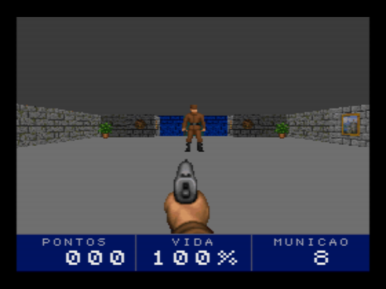
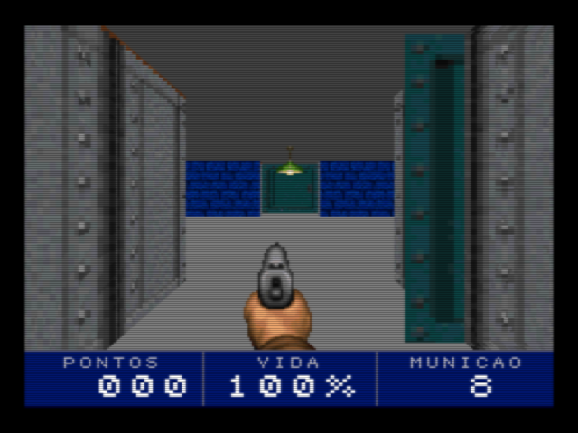
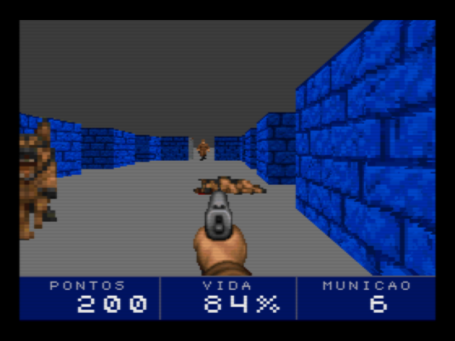
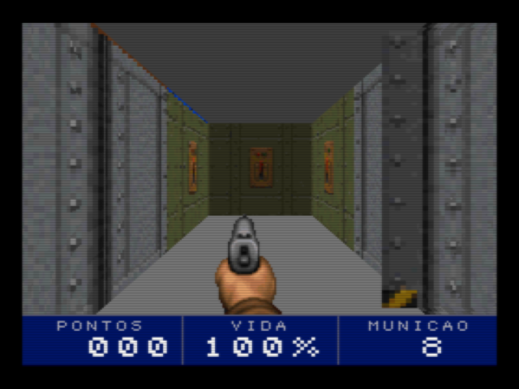
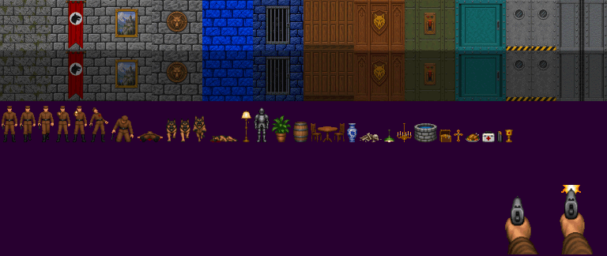

# MSX WOLF — a primeira fase do Wolfenstein 3D para MSX com V9968 + Geo3D

Cartucho de MSX (MegaROM ASCII16 de 512 KB, Z80) com a fase 1 do episódio 1 do
Wolfenstein 3D: o **Geo3D** projeta, ordena e texturiza paredes, portas, objetos e
inimigos, e o **V9968** pinta. O **traçado da fase** é o original (lido do `GAMEMAPS.WL1`
do shareware); a **arte é nova**, gerada no Higgsfield, e o **código é novo**, escrito
para este hardware a partir do que o estudo do código da id ensinou
(`../MSXDOOM/msx/docs/wolf3d-engenharia-reversa.md`).






O que tem: as 1.039 células da fase, 22 portas de correr, 17 guardas e 3 cães (os da
dificuldade média), 121 objetos (mesas, barris, lustres, comida, kits, munição, tesouros),
pistola, pontos, e o elevador que termina a fase. As capturas são do openMSX.

## Como rodar

| | |
|---|---|
| No openMSX (Windows) | duplo clique em `jogar_openmsx.bat` |
| Linha de comando | `openmsx -machine C-BIOS_V9968_JP -ext geo3d -cart release/MSXWOLF_98.ROM -romtype ASCII16` |
| Perfil do cartucho real | `openmsx -machine C-BIOS_MSX2+ -ext HRA_V9968 -ext geo3d88 -cart release/MSXWOLF_88.ROM -romtype ASCII16` |
| Hardware real | `release/MSXWOLF_88.ROM` num cartucho flash (mapper **ASCII16**), com o cartucho V9968 + Geo3D em 88h. A imagem sai no HDMI do cartucho |

O emulador é o fork V9968 + geo3d do openMSX (`C:\Projects\mmsoft\openmsx-geo3d`).

| Ação | Teclado | Joystick 1 |
|---|---|---|
| Andar para frente / trás | cursor ↑ ↓ | cima / baixo |
| Girar | cursor ← → | esquerda / direita |
| Passo lateral | Z / X | botão B + esquerda / direita |
| Atirar, começar | ESPAÇO (ou RETURN para começar) | botão A |

As portas abrem sozinhas quando o jogador chega de frente e fecham 4 segundos depois.
Comida e kits só são pegos por quem está ferido; guarda morto deixa um pente de munição.

## Como compilar e testar

Tudo roda no WSL (Ubuntu) só com `z80asm` 1.8 e `python3`, sem pacotes extras:

```
wsl -e bash -lc "cd /mnt/c/Projects/mmsoft/MSXWOLF && bash build.sh"
wsl -e bash -lc "cd /mnt/c/Projects/mmsoft/MSXWOLF && bash tests/run_tests.sh"
```

`build.sh` converte a arte (`tools/build_art.py`), gera os dados da fase
(`tools/gen_wolf.py`, que lê o mapa com `tools/wolfmap.py`), monta as duas ROMs e copia
para `release/`. O mapa é lido de `C:\Projects\mmsoft\wolf3d-shareware\wolf3d14`
(`MAPHEAD.WL1` e `GAMEMAPS.WL1`, versão 1.4 do shareware); nada mais desse pacote é usado.

`tests/run_tests.sh` roda a ROM no openMSX sem janela e confere:

| Cenário | O que confere |
|---|---|
| `poses` | Congela o jogo em 16 poses e compara a página pintada com `tools/sim.py`, que passa a mesma cena pelo **modelo de referência do Geo3D** (`V9968_Cartridge/geo3d/sim/gen_scenes.py`). Tem que dar os mesmos bytes |
| `walk` | Anda para leste desde o início: a porta abre sozinha, o jogador passa, a porta fecha |
| `combat` | Atira no guarda do salão central até cair (som no PSG, pontos, munição) e pega o pente que ele deixa |
| `pickup` | Jogador ferido passa por cima de comida; duas cruzes dão pontos |
| `death` | Fica a duas células de um guarda com 1 ponto de vida; tela final e recomeço |
| `win` | Entra no elevador: "FASE COMPLETA" |
| `dogs` | Abate um cão a duas células e leva mordida do outro |

Fora do padrão: `prof` (tempo de cada etapa do quadro), `hits` (chamadas por quadro das
rotinas caras), `docs` e `tour` (capturas, com `SHOT=1`).

`PROFILE=88` roda a ROM de 88h com `-ext HRA_V9968 -ext geo3d88`. `SHOT=1` abre a janela e
grava capturas. Resultado em 6 de outubro de 2026, nos dois perfis: **16 de 16 poses
idênticas ao modelo**, todos os cenários passam.

## A arte



30 imagens geradas no Higgsfield (modelo `gpt_image_2_5`) estão em `assets/src/`:
12 texturas de parede e porta, 8 quadros do guarda, 4 do cão, 2 da pistola e 4 folhas com
16 objetos. `build_art.py` reduz as paredes para 64x64, recorta os personagens pela
transparência e quantiza tudo para uma paleta única: 117 cores para a arte (entradas 11 a
127) e, de 128 em diante, a mesma paleta a 60 % — é a cópia escura das paredes que ficam
de frente para leste e oeste, como no original. Nada do `VSWAP.WL1` entra na ROM.

## Como o quadro é feito

SCREEN 8 (256x212, 1 byte por pixel) com a paleta estendida do V9968 (EPAL: 256 entradas
de 15 bits), duas páginas trocadas no retraço vertical. Janela 3D de 256x180 e barra de
status de 32 linhas. A cada quadro, na página escondida:

1. **Teto e piso**: dois preenchimentos HMMV lisos, como no Wolfenstein 3D.
2. **Paredes, portas, objetos e inimigos**: **um único RUN do Geo3D**, com faces
   texturizadas. O Geo3D projeta os vértices, descarta as faces de costas, ordena do fundo
   para a frente e manda um LRMM por linha para o V9968, com TIMP (o texel 0 é furo). Os
   personagens e os objetos são faces sempre de frente para a câmera e entram na mesma
   ordenação.
3. **Pistola**: duas cópias LMMM + TIMP de uma área da VRAM que nunca é exibida.
4. **Barra de status**: só quando um número muda, por cópias HMMM de dígitos desenhados
   uma vez.

Dano e itens piscam a tela trocando a paleta (768 bytes).

### O que o Z80 faz (e o que não faz)

O Wolfenstein 3D original lança um raio por coluna e escala cada coluna com código gerado
em tempo de execução. Aqui o Z80 não lança raios nem ordena nada:

| Problema | Solução no cartucho |
|---|---|
| **Visibilidade** | Pré-calculada na build. Para cada célula livre, `gen_wolf.py` lança raios e guarda as faces de parede, as portas e os objetos alcançados, cada um com o arco de direções do olhar em que aparece. O Z80 só filtra a lista pelo ângulo. São 265 KB em 17 bancos |
| **Portas fechadas** | Na build as portas são transparentes; cada item da lista leva o número da porta atrás da qual está (se for sempre a mesma). Com a porta fechada o item não é enviado; quando ela começa a abrir, a lista é refeita |
| **Áreas** (`areabyplayer` do original) | Cada célula tem a área (sala) a que pertence e a lista das áreas que enxerga: inimigo em área fora da lista não é desenhado nem procura o jogador |
| **Plano próximo** (o Geo3D descarta a face inteira se um vértice fica atrás de ZNEAR) | As paredes das 3x3 células em volta do jogador vão ao Geo3D ao entrar na célula, em quatro tiras de 64 unidades. A cada quadro o Z80 calcula a profundidade dos 16 cantos da vizinhança e, para cada parede com um canto na frente e outro atrás de Z = 16, acrescenta uma face: do cruzamento até o fim da tira. As portas próximas são cortadas do mesmo jeito |
| **Textura afim** | As tiras de 64 unidades das paredes próximas; as distantes a menos de 3,2 células vão em duas metades |
| **Parede clara e escura** | Luz do Geo3D apontada para cima e normal sintética (0, ny, 0): `ny` escolhe a faixa da área de textura (clara, escura, objetos) sem depender da direção do olhar |
| **Inimigos** | Como os atores do original: parado, só procura o jogador (um por quadro, em rodízio); perseguindo, anda de centro de célula em centro de célula e só decide ao chegar (atacar, ou a próxima célula na direção do jogador). Abrem portas |
| **Limite de 255 vértices e 255 faces por RUN** | Orçamento fixo: as paredes param em 156 vértices e 110 faces, os objetos em 200 vértices, e o resto fica para cruzamentos, portas e inimigos. Na pior célula da fase há 65 faces distantes na lista, 45 delas dentro do ângulo de visão |

A ordem do quadro evita esperas: a geometria vai para a RAM do Geo3D enquanto o quadro
anterior espera o retraço e, assim que ele entra na tela, **enquanto o V9968 preenche teto
e piso** (`bg_try`, chamado entre as faces, dispara cada preenchimento quando pode e nunca
espera); a lógica do jogo roda enquanto o Geo3D desenha.

`tools/sim.py` é o mesmo algoritmo em Python, com a mesma aritmética inteira. Serve de
especificação do `src/render.asm` e de gabarito dos testes.

### VRAM

| Linhas (SCREEN 8) | Conteúdo |
|---|---|
| 0–211 e 256–467 | As duas páginas de vídeo |
| 212–227 | Dígitos da barra de status (nunca exibidos) |
| 468–511 | Os dois quadros da pistola, em pedaços de 44 linhas |
| 512–703 | 12 texturas de parede e porta de 64x64 (4 por faixa) |
| 704–895 | As mesmas, escuras |
| 896–1023 | Quadros dos personagens e dos objetos |

### ROM (ASCII16, 32 bancos de 16 KB) e RAM

| Banco | Conteúdo |
|---|---|
| 0 | Código e tabelas de uso geral (10,8 KB dos 16) |
| 1 | Grade da fase (64x64), 3 paletas, objetos, portas, inimigos |
| 2 | Banco e endereço da lista de cada célula |
| 3–19 | Listas de visibilidade por célula |
| 20–27 | Área de textura (128 KB), copiada para a VRAM na partida |
| 28 | Pistola |

RAM: 2,7 KB a partir de C000h.

## Arquivos

```
build.sh               converte a arte, gera os dados e monta as ROMs (WSL)
jogar_openmsx.bat      abre a ROM no openMSX
release/               MSXWOLF_98.ROM (openMSX), MSXWOLF_88.ROM (cartucho real)
assets/src/            as 30 imagens do Higgsfield
src/main.asm           cabeçalho, inicialização, bancos
src/vdp.asm            registradores, comandos, paleta, carga das texturas
src/render.asm         câmera, listas da célula, paredes, portas, objetos, RUN, fundo, pistola
src/game.asm           laço do jogo, jogador, portas, tiro, itens
src/enemy.asm          guardas e cães
src/hud.asm            texto, barra de status, telas
src/isr.asm            interrupção: contagem de quadros, troca de página, som (PSG), entrada
src/math.asm           multiplicação Q2.14, divisão fracionária, distância aproximada
src/ram.asm            mapa da RAM
tools/wolfmap.py       leitor do GAMEMAPS (Carmack + RLEW)
tools/build_art.py     imagens -> texturas, quadros, paleta
tools/gen_wolf.py      mapa + arte -> grade, visibilidade, VRAM, tabelas
tools/sim.py           o quadro calculado no PC (modelo de referência do Geo3D)
tests/                 cenários no openMSX e comparação com o modelo
```

## Tempo de quadro

Medido no openMSX (Z80 a 3,58 MHz) com `tests/run_tests.sh prof`:

| Situação | Quadro médio | Pior quadro | Antes de otimizar |
|---|---|---|---|
| Parado na sala inicial | 16,7 ms (60 qps) | 18 ms | 22,3 ms (45 qps) |
| Luta com um guarda no salão | 17,6 ms (57 qps) | 40 ms | 22,4 ms |
| Parado no corredor longo | 19,5 ms (51 qps) | 26 ms | 25,0 ms |
| Andando, com portas | 24,2 ms (41 qps) | 54 ms | 28,3 ms |
| Andando e girando | 24,2 ms (41 qps) | 51 ms | 30,5 ms |

O que deu o ganho: geometria enviada durante os preenchimentos do fundo (3 ms),
multiplicação Q2.14 como duas de 8x16 bits, e uma só quando um fator é pequeno (1,2 ms),
teste de sinal antes de tratar cada parede próxima (1,7 ms), inimigos fora da janela
descartados com uma comparação (0,9 ms), face enviada com `OUT (C),r` e mapa de cantos sem
`LDIR` (5 ms por reconstrução).

O pior quadro é o da troca de célula: as tiras próximas, as faces distantes e os objetos
da célula nova são reenviados de uma vez (até 40 ms). Andando, o que limita é o próprio
desenho: paredes grandes na tela custam 8 ms de RUN.

**Esses números não são os do hardware.** O fork do openMSX não cobra tempo pela
geometria do Geo3D e aproxima a velocidade dos comandos do V9968. O que a tabela mede bem
é a parte do Z80.

## O que falta e o que não foi verificado

- **Nunca rodou em hardware real.** Tudo foi verificado no openMSX. Dependem do
  comportamento do FPGA e ainda não foram vistos numa placa: EPAL em SCREEN 8, LRMM com
  TIMP em 8 bits, HMMV e LMMM em modo rápido, e a carga de 128 KB de VRAM por `OTIR`.
- **Uma fase só**, e sem paredes secretas: as salas atrás delas (e a saída secreta) não
  são alcançáveis. O elevador mostra "FASE COMPLETA" e volta ao título.
- **Só a pistola.** Sem faca, metralhadora, vidas, chaves nem contagem de tesouros.
- **Guardas de patrulha ficam parados** até verem o jogador ou ouvirem um tiro (o tiro
  alerta os que estão em áreas à vista, não os de salas vizinhas fechadas).
- **Personagens sempre de frente**: um quadro por pose, sem as 8 direções do original.
- **Som**: efeitos no PSG; sem música.
- **Frestas**: a ordenação é de pintor (sem z-buffer) e o Geo3D não preenche a junção
  entre faces vizinhas com sub-pixel; às vezes aparece um risco de um pixel na quina de um
  batente. É o que o modelo de referência também pinta.
- **O traçado da fase é da id Software.** A ROM leva o mapa da fase 1 do shareware; a
  arte e o código são próprios. Serve para estudo e demonstração do hardware.
